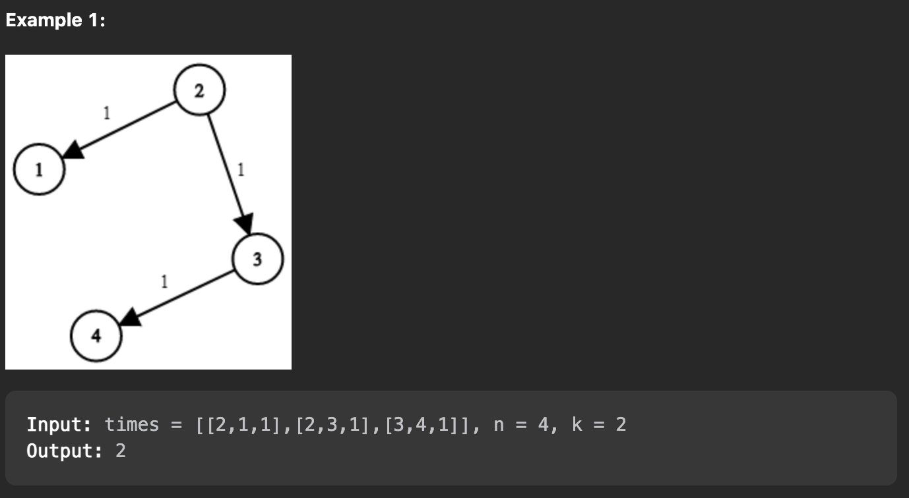

## Network Delay Time

* This snnipet of code is the solution for Leetcode problem.

* It uses the concept of <mark>shortest path algorithm</mark>.

#### Description

You are given a network of n nodes, labeled from 1 to n. You are also given times, a list of travel times as directed edges times[i] = (ui, vi, wi), where ui is the source node, vi is the target node, and wi is the time it takes for a signal to travel from source to target.

We will send a signal from a given node k. Return the minimum time it takes for all the n nodes to receive the signal. If it is impossible for all the n nodes to receive the signal, return -1.

#### Example
